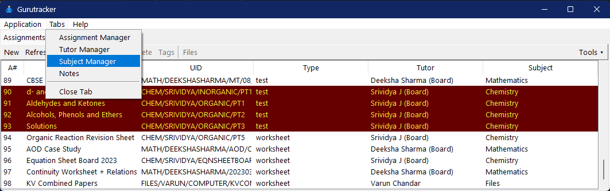
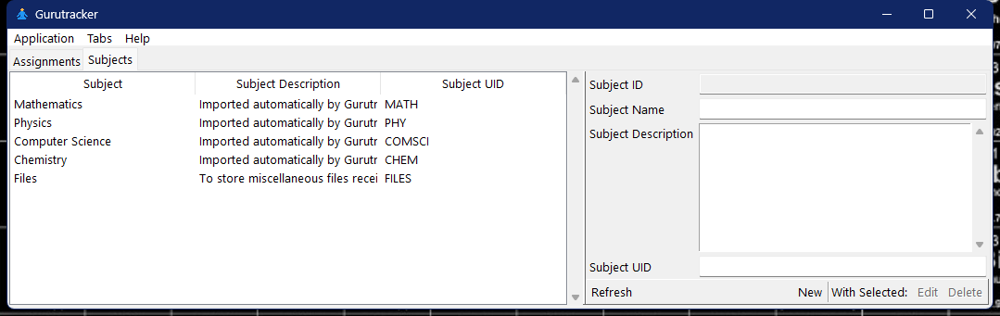
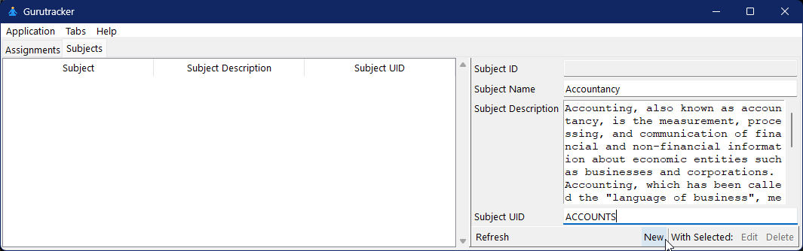
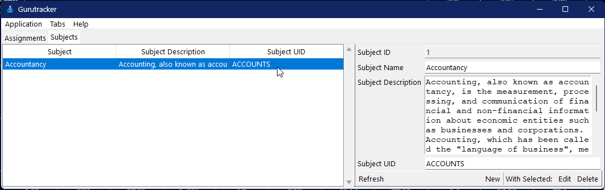

============================
Using Gurutracker
============================

----------------------------
Subjects
----------------------------

Subjects are the top-most hierachial level for classification in 
Gurutracker.

Opening the Subject Manager
============================
Select ``Subject Manager`` from the ``Tabs`` menu.

Adding a subject
================

#. Fill up the form on the right side.
#. Press ``New``.
#. The changes are reflected on the left panel.

